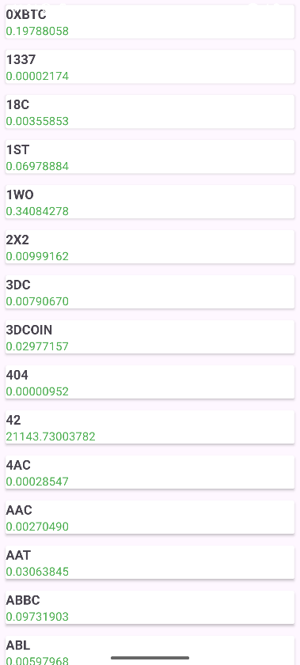

# CryptoApp🚀

**CryptoApp**, Android Studio ve Kotlin kullanılarak geliştirilmiş basit bir kripto para takip uygulamasıdır. Uygulama, uygulama içine yerleştirilmiş sabit bir JSON dosyasından kripto para verilerini okuyarak kullanıcıya liste halinde sunar.

## Özellikler ✨
- 📄 Uygulama içindeki JSON dosyasından veri çekme (offline)
- 📊 RecyclerView ile kripto para listesini gösterme
- 🔄 SwipeRefreshLayout ile listeyi yenileme
- 🖐️ ViewBinding kullanılarak modern ve güvenli UI tasarımı
- ⚠️ Hata durumunda kullanıcıya Toast mesajı ile bilgilendirme
- 🧑‍💻 Basit ve anlaşılır kod yapısı, yeni başlayanlar için uygun

## 📸 Ekran Görüntüleri

   

